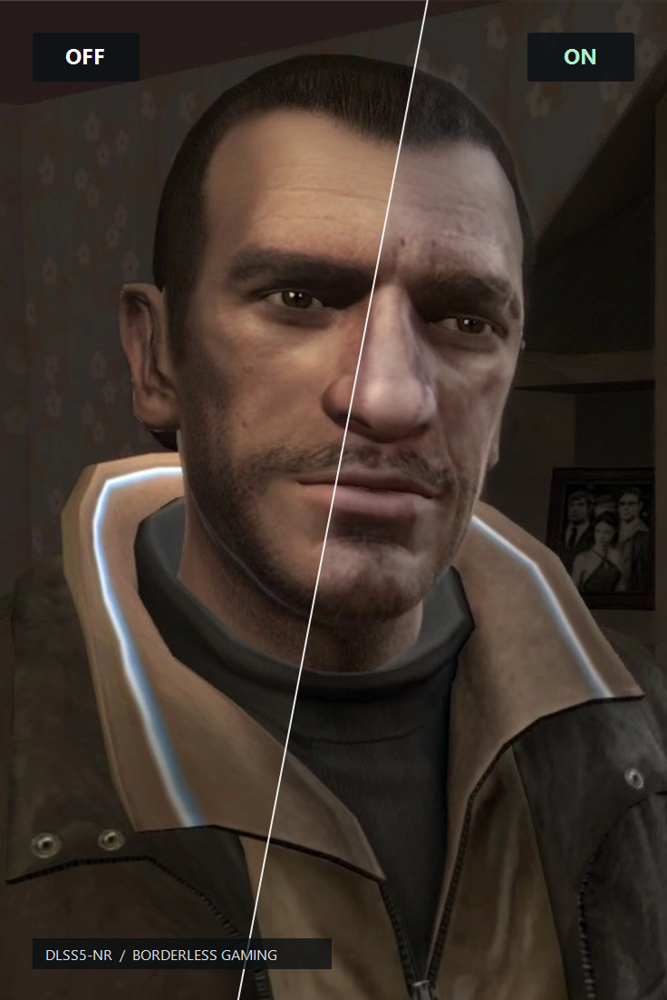
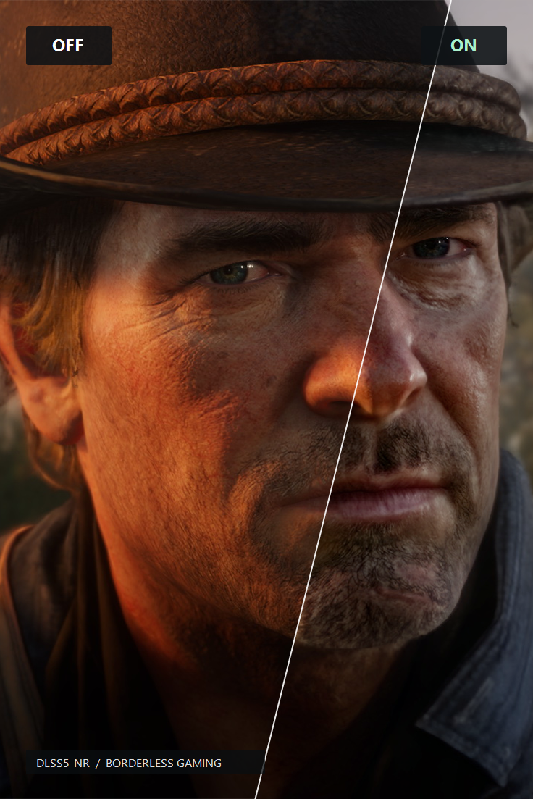
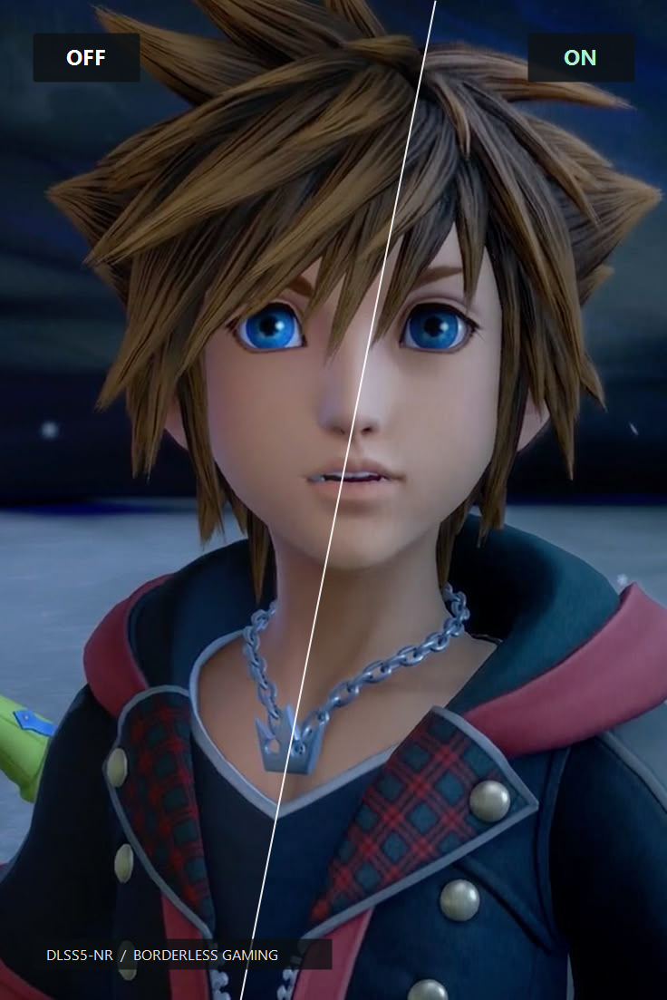

# DLSS5-NR for Borderless Gaming

Bring a new look to familiar games. DLSS5 neural rendering, optimized for Borderless Gaming—with adjustable lighting, tone and structure, on more than just the latest NVIDIA GPUs.

[Get Borderless Gaming on Steam](https://store.steampowered.com/app/388080/Borderless_Gaming/) · [Download the effect](https://github.com/andrewmd5/bgfx-dlss5-nr/releases/latest)

<table>
  <tr>
    <td width="33%" align="center" valign="bottom">
      
    </td>
    <td width="33%" align="center" valign="bottom">
      
    </td>
    <td width="33%" align="center" valign="bottom">
      
    </td>
  </tr>
  <tr>
    <td align="center">GTA IV</td>
    <td align="center">RDR2</td>
    <td align="center">Sora</td>
  </tr>
  <tr>
    <td colspan="3" align="center">OFF / ON · Strength 1 · Local tone 1.5 · Structure 2 · Natural</td>
  </tr>
</table>

## Install

1. Open the effects editor in Borderless Gaming, or the presets screen in Holo.
2. Choose **Install from GitHub** and paste `https://github.com/andrewmd5/bgfx-dlss5-nr`.
3. Select the **DLSS5-NR** preset and enable effects. On Windows, use **Scaling (GPU)**.

The download includes the compiled effect, weights and preset. Nothing to compile, no separate AI runtime to install. You can also add Neural Rendering to an existing effect chain.

## Performance

The effect adjusts lighting, tone and structure while keeping your game's output resolution. Speed depends on your GPU:

| GPU | DirectX 12 | Vulkan |
| --- | ---: | ---: |
| RTX 3090 | 8.4 ms | 10.6 ms |
| Steam Deck | — | 99.6 ms |

Median inference time, excluding the game and presentation. Leave GPU headroom; Steam Deck isn't fast enough for real-time play with this effect. Stronger settings can introduce artifacts.
